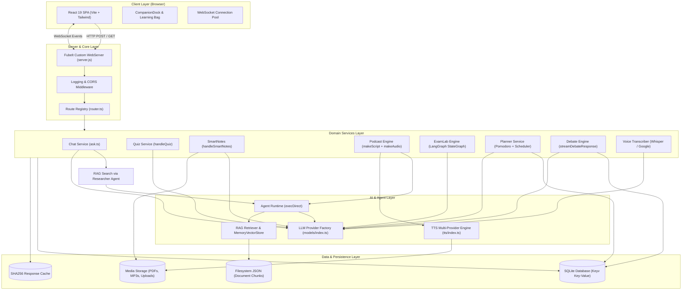
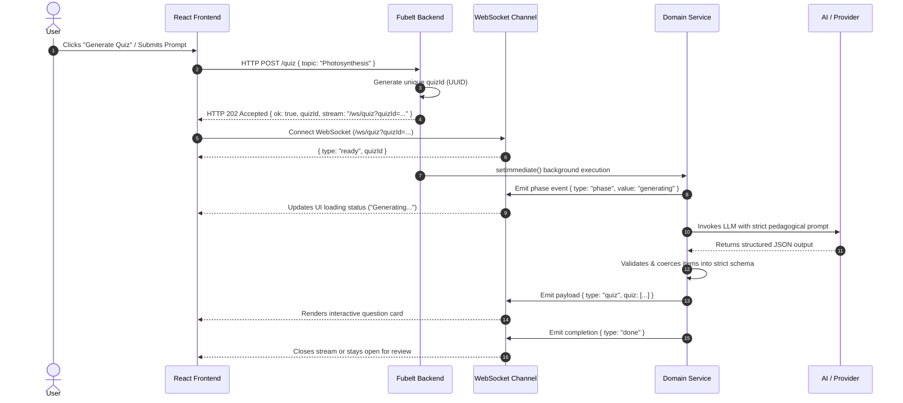
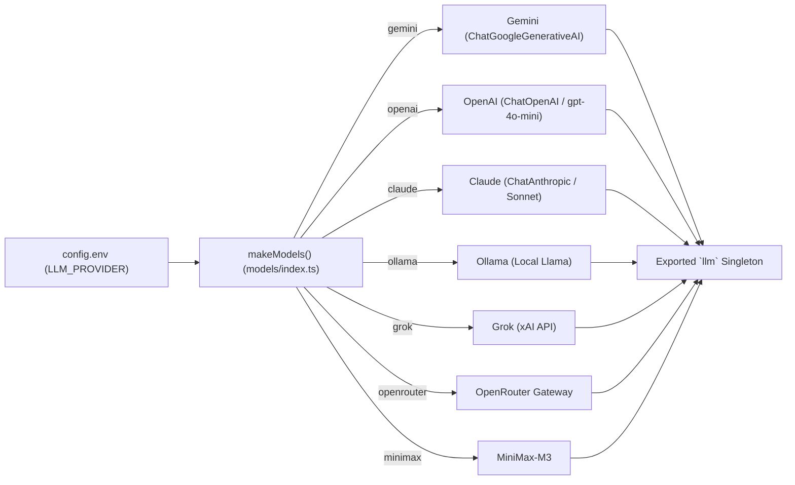
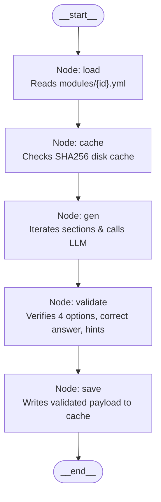

# 03 — PageLM Architecture

This document describes the complete system architecture of **PageLM**. It explains how the frontend, custom backend server, domain services, AI engines, RAG pipelines, and databases interact to create interactive learning experiences.

---

## 1. System-Wide Architectural Overview

PageLM is structured as a modern **decoupled full-stack AI application**:
- A **Single Page Application (SPA)** frontend built with React 19 and Vite.
- A **lightweight TypeScript backend server** powered by **Fubelt** (a custom Node.js HTTP/WebSocket server).
- An **asynchronous execution model** where heavy AI operations (RAG search, LLM inference, TTS speech generation) return an immediate HTTP `202 Accepted` response with a stream URL, and subsequently broadcast streaming tokens and phase events over **WebSockets**.
- A **pluggable AI & Audio layer** that decouples business logic from specific cloud or local AI providers.



---

## 2. The Core Request/Response Pattern: HTTP 202 + WebSocket Stream

One of the most defining patterns in PageLM's architecture is the **Asynchronous Stream Pattern**.

Because generating Cornell notes, synthesizing a 16-turn audio podcast, or running an exam simulation can take anywhere from 5 to 60 seconds, PageLM avoids keeping a blocking HTTP connection open. Instead:



### Why This Architecture Was Chosen:
1. **No Gateway Timeouts**: Reverse proxies (NGINX, Cloudflare) often terminate HTTP connections after 30 or 60 seconds. An immediate `202 Accepted` satisfies the proxy immediately.
2. **Real-time UX**: The user sees granular phase updates (`upload_start`, `upload_done`, `generating`, `script_created`, `audio_progress`) instead of a frozen screen.
3. **Decoupled Retries**: If the WebSocket drops temporarily, the server's background task can continue unaffected.

---

## 3. Frontend Architecture

The frontend is a lightweight React 19 application running in client-rendered SPA mode:
- **Routing**: `react-router-dom` v7 manages pages without server-side rendering overhead.
- **Global Application Shell (`App.tsx`)**:
  - `CompanionProvider`: Houses the active study document state (`id`, `title`, `text`, `filePath`) and makes it accessible across all routes.
  - `Sidebar`: Collapsible navigation docked on the left, displaying quick links and a slide-out drawer of past chat sessions.
  - `CompanionDock`: A floating AI assistant docked at the bottom right of the screen that dynamically links to whatever topic the user is viewing.
  - `AdaptiveToastProvider`: Non-intrusive notification toasts for async errors and completions.
- **Communication Layer (`lib/api.ts`)**: All HTTP endpoints and WebSocket connection factories (`connectChatStream`, `connectQuizStream`, `connectPodcastStream`, `connectPlannerStream`, `connectExamStream`) are centralized in one file.

---

## 4. Backend Architecture: The Fubelt Engine

Rather than relying on Express.js or NestJS, PageLM uses **Fubelt** (`backend/src/utils/server/server.js`), an in-house minimalist web server created by Cavira OSS.

### Key Characteristics of Fubelt:
1. **Native HTTP & WS Integration**: Uses Node's built-in `http.createServer()` and binds `ws.Server({ noServer: true })` directly to HTTP `upgrade` events.
2. **Linear Middleware Chain**: An array of functions executed sequentially (`next()`), implementing JSON body parsing (with a 1MB safety cap) and CORS.
3. **Route Matcher**: A segment-by-segment URI tokenizer that decodes dynamic URL parameters (e.g. `/chats/:id` or `/tasks/:id/files/:fileId`).
4. **Static File Server**: A custom `serverStatic("/storage", "./storage")` method that safely serves generated PDFs and audio files with MIME-type resolution and directory traversal guards.

---

## 5. Domain Service Architecture

PageLM organizes application features into dedicated service modules located under `backend/src/services/`. Each service acts as an independent domain engine:

| Service | Entry File | Architectural Responsibility |
| :--- | :--- | :--- |
| **Chat & Q&A** | `lib/ai/ask.ts` | Orchestrates RAG context retrieval via the `researcher` agent, builds anti-rote prompts, queries the LLM, and caches outputs to disk. |
| **Quiz** | `services/quiz/index.ts` | Enforces a strict 5-item MCQ schema, cleans options, guarantees valid correct answer indices, and handles fallback retries. |
| **SmartNotes** | `services/smartnotes/index.ts` | Generates Cornell notes (notes, summary, cue questions) and formats them into fillable PDF templates or raw Helvetica layouts using `pdf-lib`. |
| **Podcast** | `services/podcast/index.ts` | Uses the `podcaster` agent to draft an alternating 2-speaker script, synthesizes audio segments via TTS, and concatenates with FFmpeg. |
| **ExamLab** | `services/examlab/generate.ts` | Executes a multi-stage LangGraph state graph that reads YAML exam definitions, generates section questions, and validates structure. |
| **Homework Planner**| `services/planner/service.ts` | Ingests natural language task descriptions, breaks them into sub-steps, schedules Pomodoro slots, and emits daily digests and break reminders. |
| **Debate** | `services/debate/index.ts` | Streams opposing arguments token-by-token, detects AI concession triggers (`[CONCEDE]`), and provides post-debate judicial scoring. |
| **Voice Transcriber**| `services/transcriber/index.ts`| Accepts audio streams via Busboy, invokes STT providers, and automatically generates structured study guides. |

---

## 6. AI & Provider Abstraction Architecture

A core design principle of PageLM is that **no application feature is locked to a single AI provider**.

The model factory in `backend/src/utils/llm/models/index.ts` exposes a unified `LLM` and `EmbeddingsLike` interface:

```typescript
export interface LLM {
  invoke(m: Msg[]): Promise<any>
  call(m: Msg[]): Promise<any>
}

export type EmbeddingsLike = {
  embedDocuments(texts: string[]): Promise<number[][]>
  embedQuery(text: string): Promise<number[]>
}
```



Whenever any service calls `llm.invoke(messages)` or `llm.call(messages)`, it works identically regardless of whether the underlying model is Google Gemini, OpenAI GPT-4o, or a local Ollama model.

---

## 7. LangGraph State Machine Architecture (ExamLab)

For complex multi-step workflows, PageLM utilizes `@langchain/langgraph`. The **ExamLab** engine is built as a compiled `StateGraph` state machine:



Each node is an isolated, testable async function that receives the graph state (`examId`, `spec`, `payload`) and returns an updated state.

---

## 8. Data Architecture & Persistence

PageLM maintains a hybrid data architecture designed to minimize external infrastructure dependencies:

1. **Structured Data (Keyv + SQLite)**:
   - Saved in `storage/database.sqlite`.
   - Keys use structured namespaces:
     - `chat:${id}`: Chat metadata.
     - `msgs:${id}`: Message array.
     - `chat:index`: List of recent chat IDs.
     - `flashcard:${id}` & `flashcards`: Saved study flashcards.
     - `planner:task:${id}` & `planner:tasks`: Homework planner tasks.
     - `debate:session:${id}` & `debate:sessions`: Debate transcripts and scores.
2. **RAG Vector Data (JSON or Chroma)**:
   - Default (`db_mode=json`): Stored as human-readable JSON files in `storage/json/${collection}.json`. Loaded on-demand into an in-memory `MemoryVectorStore`.
   - Production / Scale (`db_mode=chroma`): Indexed into a Chroma vector database instance at `http://localhost:8000`.
3. **Response Caching (Disk Cache)**:
   - Stored in `storage/cache/ask/` and `storage/cache/exam/`.
   - Cache keys are generated by taking the SHA256 hash of the query, context, and system prompt.
4. **Media Artifacts**:
   - `storage/smartnotes/`: Cornell notes PDF files.
   - `storage/podcasts/`: Audio files and concatenated MP3s.
   - `storage/uploads/`: Staged file uploads.
