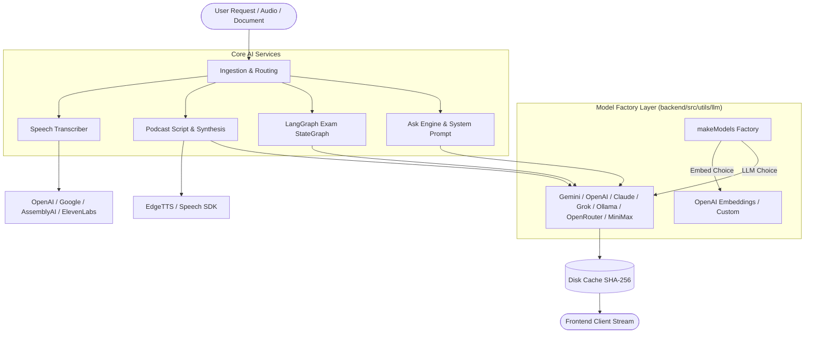
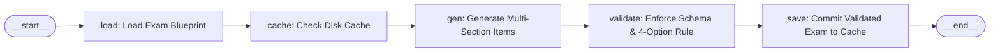

# 07. AI Architecture & Model Integration

This guide provides an in-depth breakdown of PageLM's artificial intelligence subsystem. It covers the model factory layer, prompt engineering philosophy, multi-provider model switching, vector embeddings, stateful multi-agent workflows with LangGraph, Text-to-Speech (TTS), and Speech-to-Text (STT) capabilities.

---

## 1. High-Level AI Pipeline

PageLM integrates heterogeneous AI capabilities into an active learning engine:



---

## 2. Multi-Provider Model Factory (`backend/src/utils/llm/models`)

PageLM uses a clean factory abstraction pattern that shields application services from provider-specific SDK idiosyncrasies.

### Supported Providers
The factory is selected via the `PROVIDER` environment variable (defaults to `gemini`):

1. **Google Gemini** (`gemini.ts`): Uses `@langchain/google-genai` (`gemini-1.5-flash` or `gemini-1.5-pro`). High context window, fast responses, and cost-effective.
2. **OpenAI** (`openai.ts`): Uses `@langchain/openai` (`gpt-4o-mini` or `gpt-4o`). Supports custom `OPENAI_BASE_URL` for self-hosted proxies.
3. **Anthropic Claude** (`claude.ts`): Uses `@langchain/anthropic` (`claude-3-5-sonnet-20241022`).
4. **xAI Grok** (`grok.ts`): OpenAI-compatible client targeted at `api.x.ai/v1` using `grok-beta`.
5. **Ollama (Local AI)** (`ollama.ts`): Uses `@langchain/community/chat_models/ollama` (`llama3`, `mistral`, `qwen`). Enables completely offline, private learning.
6. **OpenRouter** (`openrouter.ts`): Aggregator gateway providing access to DeepSeek, Llama 3, Mixtral, and hundreds of open-source models via a single API key.
7. **MiniMax** (`minimax.ts`): Chinese high-performance LLM provider via OpenAI-compatible endpoints.

### Embeddings Decoupling
Embeddings can be configured separately from the generation model using `EMB_PROVIDER` (defaults to `openai` via `text-embedding-3-large` or `text-embedding-3-small`). If a local LLM like Ollama is selected without native embedding support, PageLM gracefully falls back to the configured fallback embedding provider.

---

## 3. The Pedagogical System Prompt (`BASE_SYSTEM_PROMPT`)

Located in `backend/src/lib/ai/ask.ts`, `BASE_SYSTEM_PROMPT` is the pedagogical heart of PageLM. It instructs the LLM to output pure JSON and strictly enforces an anti-rote learning doctrine.

### JSON Output Contract
```json
{
  "topic": "String representing the detected or refined topic",
  "answer": "GitHub-Flavored Markdown response structured with Feynman mental models",
  "flashcards": [
    {
      "q": "Why does X happen when Y occurs?",
      "a": "Because...",
      "tags": ["cognitive_load", "transfer", "metacognition", "deep", "anti_rote"]
    }
  ]
}
```

### Core Pedagogical Pillars Embedded in Prompts:
1. **Anti-Rote Mandate**: Actively bans pure recall phrases ("Memorize that X = Y", "The formula is..."). Instead, demands intuition-first derivations ("X works like Y because of underlying principle Z").
2. **Feynman Technique**: Explain complex phenomena simply enough that an inquisitive 12-year-old could follow, using humor, relatable real-world analogies, and surprising connections.
3. **Cognitive Load Optimization**: Balances intrinsic and extraneous cognitive load through progressive disclosure (0–10 depth scaling) and ASCII diagrammatic scaffolding.
4. **Metacognitive Calibration**: Formulates self-diagnostic questions that force students to evaluate *how* they understand the concept, rather than simply confirming familiarity.

---

## 4. Response Caching Engine

All primary LLM inferences in `ask.ts` and `examlab/generate.ts` pass through a deterministic disk cache:
- **Location**: `storage/cache/ask/` and `storage/cache/exam/`
- **Cache Key**: `crypto.createHash("sha256").update(JSON.stringify({ query, context, history, systemPrompt })).digest("hex")`
- **Benefits**:
  1. Prevents duplicate charges and latency during rapid UI re-renders or page refreshes.
  2. Ensures offline accessibility for previously explored topics.
  3. Accelerates automated testing and local debugging.

---

## 5. LangGraph StateGraph in ExamLab (`services/examlab/generate.ts`)

PageLM uses `@langchain/langgraph` to orchestrate deterministic, multi-phase exam generation pipelines:



### Graph Nodes and Responsibilities:
1. **`load`**: Loads the declarative exam specification (e.g., section timings, question counts, topic constraints) from `loader.ts`.
2. **`cache`**: Checks if an identical exam run has already been rendered.
3. **`gen`**: Iterates through each section, generating high-order multiple-choice questions (MCQs) and problem scenarios via the LLM.
4. **`validate`**: A strict guardrail node checking that:
   - Every question item has an integer ID.
   - Every MCQ has exactly 4 distinct options.
   - The correct answer index is between 1 and 4.
   - Explanations and progressive hints are populated.
5. **`save`**: Persists the validated payload to disk before streaming it to the frontend via chunked WebSockets.

---

## 6. Text-to-Speech (TTS) Engine (`utils/tts/index.ts`)

PageLM turns generated educational content and study notes into natural podcasts featuring two co-hosts discussing the material.

### Dual TTS Architectures:
1. **Microsoft Edge TTS (Default & Free)**:
   - Uses `node-edge-tts` to access neural speech synthesis directly without API keys.
   - Default voices: `en-US-GuyNeural` (Host 1) and `en-US-JennyNeural` (Host 2).
   - Generates individual MP3 audio clips for each dialogue turn.
2. **Speech SDK Provider Hub**:
   - Integrates `@speech-sdk/core` supporting 14 enterprise audio providers (ElevenLabs, OpenAI, Cartesia, Deepgram, Google, Hume, Minimax, Mistral, Murf).
3. **Audio Stitching with FFmpeg**:
   - Compiles individual speech clips into a seamless dialogue track using FFmpeg concat:
     ```bash
     ffmpeg -y -f concat -safe 0 -i list.txt -c:a libmp3lame -b:a 192k out.mp3
     ```
   - Emits real-time progress events across the WebSocket so the frontend progress bar reflects exact audio rendering progress.

---

## 7. Speech-to-Text (STT) & Study Generation (`services/transcriber`)

PageLM allows students to record or upload lectures, webinars, and study sessions for instant transcription and study material extraction.

### Multi-Provider Transcription:
- **OpenAI Whisper**: High-accuracy multi-lingual transcription via `whisper-1`.
- **Google Cloud Speech**: Streaming or batch audio speech recognition.
- **AssemblyAI & ElevenLabs**: Specialized speech models with speaker diarization.

### Automatic Study Material Synthesis:
Whenever transcription yields text exceeding 50 characters, PageLM automatically runs a secondary LLM pipeline that produces:
- Executive summaries and bulleted key takeaways.
- Core conceptual vocabulary with formal definitions.
- Self-test practice questions.
- Chronological timestamped markers indicating topic shifts in the lecture.

---

## 8. Guidance for Beginners & Extensibility

- **Adding a New LLM Provider**:
  1. Create `backend/src/utils/llm/models/<new_provider>.ts` implementing the `LLM` and `EmbeddingsLike` interfaces.
  2. Add the provider case in `backend/src/utils/llm/models/index.ts`.
  3. Define API key and model defaults in `backend/src/config/env.ts`.
- **Adjusting Pedagogical Tone**:
  1. Edits to the teaching persona or Feynman guidelines should be made directly in `BASE_SYSTEM_PROMPT` inside `backend/src/lib/ai/ask.ts`.
  2. Clear the cache directory `storage/cache/ask/` after prompt edits to ensure stale cached answers do not mask your changes.
