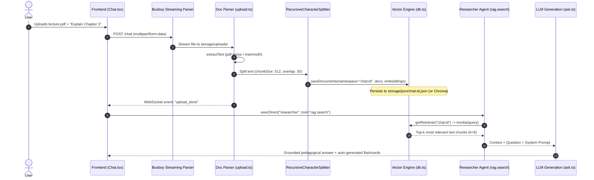

# 08. RAG & Document Processing Pipeline

This guide details the Retrieval-Augmented Generation (RAG) subsystem in PageLM. It explains how external documents (PDF, DOCX, Markdown, Text) are ingested, parsed, chunked, embedded, indexed, and retrieved during conversations and study sessions.

---

## 1. End-to-End RAG Workflow

When a user uploads a textbook, syllabus, or lecture slides alongside a question, PageLM processes the document through an isolated namespace pipeline:



---

## 2. Multi-Format File Parsing (`backend/src/lib/parser/upload.ts`)

PageLM supports diverse academic document types through specialized node libraries:

| Format | File Extensions | Parsing Library | Extraction Strategy |
| :--- | :--- | :--- | :--- |
| **PDF** | `.pdf` | `pdf-parse` | Extracts raw textual streams and font layouts from binary buffer. |
| **Word Docs** | `.docx`, `.doc` | `mammoth` | Extracts semantic raw text, stripping proprietary formatting and XML markup. |
| **Markdown** | `.md`, `.markdown` | `marked` | Converts markdown syntax into clean plain text for tokenization. |
| **Plain Text** | `.txt`, `.csv` | Native Node.js `Buffer` | Decoded directly as UTF-8 string. |

### Streaming Ingestion with Busboy
Files are not buffered entirely into memory. Instead:
1. `Busboy` processes the incoming HTTP stream chunk-by-chunk.
2. The raw file is piped into `storage/uploads/${Date.now()}-${filename}`.
3. Extracted text is saved as a companion file (`${filePath}.txt`) before embedding.

---

## 3. Text Chunking Strategy (`backend/src/lib/ai/embed.ts`)

Accurate retrieval requires chunk sizes that preserve semantic context without exceeding embedding token limits.

- **Splitter**: `@langchain/textsplitters` -> `RecursiveCharacterTextSplitter`
- **Chunk Size**: `512` characters
- **Chunk Overlap**: `30` characters
- **Separators**: Priority order `["\n\n", "\n", " ", ""]` (splits on paragraph breaks first, then sentence breaks, then words).

```typescript
const splitter = new RecursiveCharacterTextSplitter({ 
  chunkSize: 512, 
  chunkOverlap: 30 
})
const docs: Document[] = await splitter.createDocuments([rawText])
```

---

## 4. Vector Storage Architectures (`backend/src/utils/database/db.ts`)

PageLM supports two pluggable vector storage modes governed by `config.db_mode` (or `DB_MODE` env var):

### Mode A: Zero-Dependency JSON Storage (`DB_MODE=json`) — *Default*
To allow beginners and students to run PageLM without installing vector databases or Docker containers:
1. **Persistence**: Extracted chunks and metadata are serialized to a structured JSON file at `storage/json/${collection}.json`.
2. **In-Memory Vector Search**: When a search is triggered, the JSON file is hydrated into `@langchain/classic/vectorstores/memory` (`MemoryVectorStore`).
3. **Caching**: In-memory retrievers are cached in a module-level dictionary (`retrieverCache[collection]`) to avoid re-embedding on subsequent questions within the same session.

### Mode B: ChromaDB Vector Engine (`DB_MODE=chroma`)
For large-scale production deployments:
1. Connects to a running Chroma server at `http://localhost:8000` (configurable via `CHROMA_URL`).
2. Configured with Cosine distance metric: `{ "hnsw:space": "cosine" }`.
3. Supports massive document libraries with persistent on-disk HNSW index graphs.

---

## 5. Namespace Isolation & Multi-Tenancy

Every conversation or document upload is isolated using namespaces:
- **Chat Uploads**: `chat:${chatId}` (Ensures a document uploaded in Chat A is never accidentally retrieved in Chat B).
- **Global Knowledge**: `pagelm` (Default namespace for general platform materials).
- **Task Syllabi**: `task:${taskId}` (Materials associated with specific course assignments).

When `rag.search` is invoked, it passes the exact `ns` parameter to restrict vector retrieval strictly to that boundary.

---

## 6. Context Injection & Grounding (`backend/src/lib/ai/ask.ts`)

Once top-k chunks (default `k=6`) are retrieved:
1. Document passages are concatenated into a cohesive context block:
   ```text
   Context:
   [Passage 1 content...]
   
   [Passage 2 content...]
   
   Question:
   Explain the difference between mitosis and meiosis based on the text.
   
   Topic:
   Cell Division
   ```
2. In the **Study Companion** mode (`backend/src/core/routes/companion.ts`), a strict grounding prompt is injected:
   > "Use ONLY the supplied context to respond. If the context is insufficient, say so clearly rather than guessing."
3. This completely prevents AI hallucination when students review technical papers or textbooks.

---

## 7. Troubleshooting & Beginner Tips

- **Missing Text from Scanned PDFs**: `pdf-parse` extracts digital text. If a PDF is a scanned image, extraction will yield empty text. A future contribution opportunity is integrating Tesseract OCR.
- **Inspect Saved Chunks**: You can inspect the exact chunked text by opening `storage/json/chat:<your-chat-id>.json`. This is helpful for verifying whether your document was split properly.
- **Clearing Vector State**: Delete `storage/json/` or `storage/uploads/` at any time to clear stored document indexes during development.
