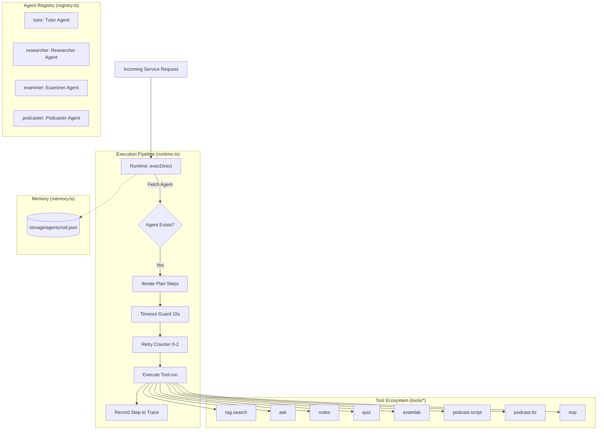

# 09. Multi-Agent Framework

This guide explains the multi-agent architecture within PageLM (`backend/src/agents/`). It breaks down agent registration, execution plans, sandboxed tool invocations, execution tracing, timeouts, retry logic, and session memory persistence.

---

## 1. Multi-Agent Architecture Overview

Rather than relying on a single monolithic prompt, PageLM defines specialized autonomous agents with restricted toolsets and explicit behavioral roles.



---

## 2. The Core Agent Roster (`backend/src/agents/agents.ts`)

PageLM registers four specialized agents upon application boot:

| Agent ID | Display Name | System Persona (`sys`) | Assigned Tools | Primary Purpose |
| :--- | :--- | :--- | :--- | :--- |
| **`tutor`** | Tutor | *"You teach and assess."* | `nop`, `notes`, `quiz`, `ask` | Interactive Socratic teaching, generating personalized notes, and dynamic questioning. |
| **`researcher`**| Researcher | *"You aggregate context and draft outputs."* | `nop`, `rag.search`, `ask` | Document parsing, vector retrieval across namespaces, and grounded context synthesis. |
| **`examiner`** | Examiner | *"You design assessments."* | `nop`, `examlab`, `quiz` | Formal multi-section exam drafting, grading rubrics, and diagnostic difficulty calibration. |
| **`podcaster`** | Podcaster | *"You turn materials into podcast scripts and synthesize audio."* | `nop`, `podcast.script`, `podcast.tts` | Scripting conversational host dialogues and triggering audio synthesis. |

---

## 3. Tool Definition Contract (`backend/src/agents/types.ts`)

Every tool in PageLM implements the standard `ToolIO` interface:

```typescript
export type ToolIO = {
  name: string
  desc: string
  schema?: Record<string, any>
  run: (input: any, ctx: Record<string, any>) => Promise<any>
}
```

### Registered Tools:
1. **`rag.search`** (`Ragsearch.ts`): Queries vector collections (`json` or `chroma`) using cosine similarity to return top-k passages.
2. **`ask`** (`ask.ts`): Invokes the core Feynman LLM engine with anti-rote system prompts.
3. **`notes`** (`notes.ts`): Triggers the smart synthesis of markdown study guides.
4. **`quiz`** (`quiz.ts`): Generates structured 4-option MCQs.
5. **`examlab`** (`examlab.ts`): Executes LangGraph stateful test generation.
6. **`podcast.script`** & **`podcast.tts`** (`podcast.ts`): Writes two-host dialogue scripts and coordinates TTS voice actors.
7. **`nop`** (`nopTool.ts`): No-operation pass-through tool used for heartbeat checks and pipeline testing.

---

## 4. Execution Engine (`backend/src/agents/runtime.ts`)

Execution is handled by `execDirect({ agent, plan, ctx })`:

### 1. Deterministic Step Execution
A plan consists of an array of sequential steps:
```typescript
const plan = {
  steps: [
    { tool: "rag.search", input: { q: "Entropy", ns: "physics" }, timeoutMs: 8000, retries: 1 },
    { tool: "ask", input: { topic: "Entropy" }, timeoutMs: 15000 }
  ]
}
```

### 2. Timeout & Retry Guardrails
- **Timeout Protection**: Each tool invocation is wrapped with `Promise.race` against `setTimeout`. If execution exceeds `timeoutMs` (defaults to 15,000 ms), the step fails cleanly.
- **Exponential Backoff & Retries**: Supports up to 2 retry attempts (`retries: Math.min(2, Math.max(0, retries))`).

### 3. Execution Tracing
For every plan run, `execDirect` generates a unique hexadecimal `threadId` (via `randomBytes(12)`) and produces a detailed execution trace:
```json
{
  "threadId": "3a8c7b9e1204d830f142a7bc",
  "trace": [
    {
      "step": 1,
      "tool": "rag.search",
      "input": { "q": "Entropy", "ns": "physics" },
      "output": [{ "text": "Entropy is a measure of molecular disorder..." }],
      "err": null,
      "retries": 0
    }
  ],
  "result": [{ "text": "Entropy is a measure of molecular disorder..." }]
}
```

---

## 5. Agent Session Memory (`backend/src/agents/memory.ts`)

PageLM provides lightweight, file-backed agent memory:
- **Storage Location**: `storage/agents/${sid}.json`
- **Functions**:
  - `load(sid)`: Loads agent conversation memory or scratchpad state for session `sid`.
  - `save(sid, state)`: Writes updated state to disk.

---

## 6. Important Codebase Note for Contributors

> [!IMPORTANT]
> **Subtle Bug in `backend/src/lib/ai/ask.ts`**:
> In `ask.ts` (lines 332-338), `execDirect` is invoked as follows:
> ```typescript
> const rag = await execDirect({
>   agent: "researcher",
>   plan: { steps: [{ tool: "rag.search", input: { q: safeQ, ns: nsFinal, k }, timeoutMs: 8000, retries: 1 }] },
>   ctx: { ns: nsFinal }
> })
> const ctxDocs = Array.isArray(rag) ? (rag as Array<{ text?: string }>) : []
> ```
> Notice that `execDirect` returns `{ trace, result, threadId }` (an object), **not** an array. As a result, `Array.isArray(rag)` evaluates to `false`, causing `ctxDocs` to resolve to `[]`.
> 
> **How to fix this in future PRs**:
> ```typescript
> const ctxDocs = Array.isArray(rag?.result) ? (rag.result as Array<{ text?: string }>) : []
> ```
> This is a prime example of an open-source bug that is easily overlooked without tracing runtime return signatures.

---

## 7. How to Add a New Agent

1. Create or register your agent in `backend/src/agents/agents.ts`:
   ```typescript
   const coder: Agent = reg({
     id: "coder",
     name: "Coding Assistant",
     sys: "You assist students in writing clean TypeScript code.",
     tools: [nopTool, askTool],
   })
   ```
2. If new tools are required, create them in `backend/src/agents/tools/<toolName>.ts` and assign them to the agent's `tools` array.
3. Call your agent anywhere in backend services using `execDirect`:
   ```typescript
   const output = await execDirect({
     agent: "coder",
     plan: { steps: [{ tool: "ask", input: { q: "How do interfaces work in TypeScript?" } }] }
   })
   ```
