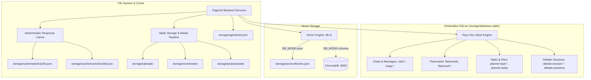

# 10. Database & Persistence Architecture

This document describes how PageLM persists application state, conversations, tasks, flashcards, vector embeddings, cached inference results, and media files without requiring complex external database servers.

---

## 1. Storage Architecture Overview

PageLM adopts an embedded-first storage philosophy designed for zero friction during local development and offline learning:



---

## 2. Key-Value Storage via Keyv & SQLite (`backend/src/utils/database/keyv.ts`)

The primary transactional store is built on `keyv` paired with `@keyv/sqlite`.

- **Database File**: `storage/database.sqlite`
- **Adapter**: `@keyv/sqlite`
- **Benefits**:
  - Requires no background database daemon or installation.
  - ACID-compliant transactional consistency.
  - Cross-platform portability (stored within the repository root).

### Key Namespaces and Data Schemas

#### 1. Chat Sessions & History (`utils/chat/chat.ts`)
- **`chat:index`**: Array of up to 1,000 chat session UUID strings, sorted newest to oldest.
- **`chat:${chatId}`**: Metadata object:
  ```json
  { "id": "uuid", "title": "First 60 chars of prompt", "at": 1741000000000 }
  ```
- **`msgs:${chatId}`**: Array of chronological messages:
  ```json
  [
    { "role": "user", "content": "Explain relativity", "at": 1741000000000 },
    { "role": "assistant", "content": "{ ...JSON payload... }", "at": 1741000002000 }
  ]
  ```

#### 2. Flashcards (`core/routes/flashcards.ts`)
- **`flashcards`**: Global array of all user flashcard items.
- **`flashcard:${id}`**: Individual card object:
  ```json
  {
    "id": "uuid",
    "question": "What is the mitochondria?",
    "answer": "The powerhouse of the cell...",
    "tag": "Biology",
    "created": 1741000000000
  }
  ```

#### 3. Task & Study Planner (`services/planner/store.ts`)
- **`planner:tasks`**: Array of index records `[{ "id": "uuid" }]`.
- **`planner:task:${id}`**: Full task model:
  ```json
  {
    "id": "uuid",
    "title": "CS101 Final Project",
    "course": "Computer Science",
    "type": "project",
    "notes": "Build a compiler",
    "dueAt": "2026-09-15T23:59:59Z",
    "estMins": 240,
    "priority": 1,
    "status": "todo",
    "steps": [ ... ],
    "plan": { "slots": [ ... ] },
    "createdAt": "...",
    "updatedAt": "..."
  }
  ```
- **`planner:task_files`** & **`planner:task_file:${id}`**: Index and file descriptors for files linked to specific course tasks.

#### 4. Debate Matches (`services/debate/index.ts`)
- **`debate:sessions`**: Array of active and historical debate IDs.
- **`debate:session:${id}`**: Debate transcript, speaker turns, surrender status, and judge analysis.

---

## 3. Vector Embeddings Persistence (`utils/database/db.ts`)

PageLM isolates vector persistence from relational storage:

### 1. Zero-Dependency JSON Vector Storage (`DB_MODE=json`)
- **File Location**: `storage/json/${collection}.json`
- **File Contents**:
  ```json
  [
    {
      "pageContent": "Quantum mechanics explores energy quanta...",
      "metadata": { "source": "lecture1.pdf", "page": 2 }
    }
  ]
  ```
- **Mechanism**: On query, documents are read into `@langchain/classic/vectorstores/memory`. Embeddings are cached in memory so similarity search executes at in-RAM speeds without recomputing vectors.

### 2. ChromaDB Server (`DB_MODE=chroma`)
- Communicates over REST with a Chroma server instance at `http://localhost:8000`.
- Collections are partitioned by namespace with cosine similarity indexing.

---

## 4. Inference Disk Cache

To prevent repeated token consumption and minimize API bills, AI inferences are cached based on SHA-256 digests of their input contexts:

| Cache Subsystem | Path | Hash Input Parameters |
| :--- | :--- | :--- |
| **Ask / RAG** | `storage/cache/ask/${sha256}.json` | `query`, `context`, `topic`, `systemPrompt`, `history` |
| **ExamLab** | `storage/cache/exam/${sha256}.json` | `examId` blueprint configuration |

---

## 5. Media & Artifact Storage Layout

All temporary, generated, and uploaded assets reside under the top-level `storage/` directory (ignored by git):

```text
storage/
├── database.sqlite       # Keyv SQLite database file
├── uploads/              # Raw user uploads (PDFs, MP3s) + extracted .txt
├── json/                 # JSON vector collections (chat:id.json, pagelm.json)
├── cache/
│   ├── ask/              # SHA-256 cached LLM answers
│   └── exam/             # SHA-256 cached exam payloads
├── smartnotes/           # Rendered markdown study notes (*.md)
├── podcasts/
│   └── <pid>/            # Temporary voice chunks, list.txt, and final MP3
└── agents/               # File-backed agent memory (sid.json)
```

---

## 6. Important Notes for Contributors

1. **Unused `backend/src/utils/database/sqlite.ts`**:
   The file `sqlite.ts` implements a raw `sqlite3` wrapper class. However, `sqlite3` is not included in root `package.json` dependencies; instead, `@keyv/sqlite` handles all database interactions. Do not import `sqlite.ts` in new code.
2. **Backing Up Data**:
   To backup user data, simply copy `storage/database.sqlite` and the `storage/json/` directory.
3. **Resetting to Fresh State**:
   To reset PageLM to a factory state, stop the backend and remove the `storage/` directory (or delete `storage/database.sqlite`). The server will automatically re-create the directory structure and SQLite file on next launch.
