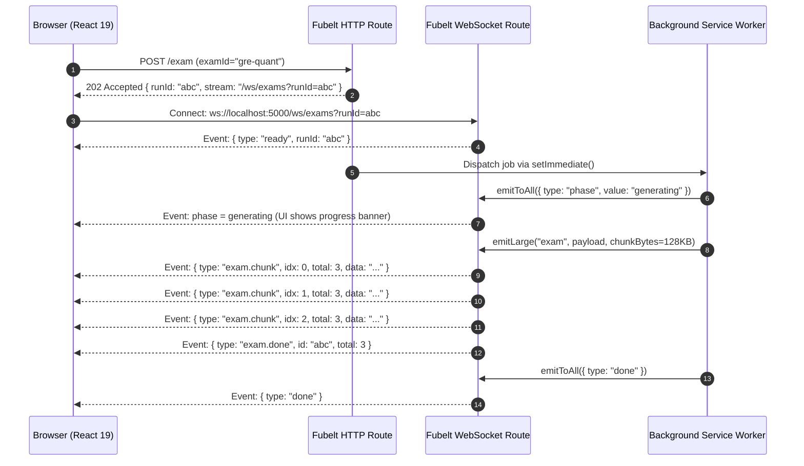

# 11. Real-Time Streaming & WebSockets Guide

This guide details the real-time communication architecture in PageLM. It covers WebSocket lifecycle management, room routing, ping/pong heartbeats, the `emitLarge` payload chunking protocol with backpressure handling, and frontend stream consumption.

---

## 1. Why WebSockets? (The Active Learning Latency Challenge)

Generating rich pedagogical content (such as multi-minute podcasts, multi-section exams, Socratic dialogue, and real-time debates) takes anywhere from 3 to 120 seconds. 

Traditional HTTP request/response models create poor user experiences during long waits:
- Browsers time out on idle connections.
- Users see frozen spinners without knowing if work is progressing.
- Large JSON payloads can block single threads or drop packets.

PageLM solves this by pairing **HTTP 202 Accepted triggers** with **dedicated WebSocket streaming pipelines**:



---

## 2. Server-Side WebSocket Management

### Connection Multiplexing by ID
Each WebSocket route groups clients into an in-memory Map of Sets:
```typescript
// backend/src/core/routes/quiz.ts
const qs = new Map<string, Set<WebSocket>>()

app.ws("/ws/quiz", (ws: WebSocket, req: IncomingMessage) => {
  const url = new URL(req.url, "http://localhost")
  const id = url.searchParams.get("quizId")
  if (!id) return ws.close(1008, "quizId required")

  let s = qs.get(id)
  if (!s) { s = new Set(); qs.set(id, s) }
  s.add(ws)

  ws.send(JSON.stringify({ type: "ready", quizId: id }))

  ws.on("close", () => {
    s!.delete(ws)
    if (s!.size === 0) qs.delete(id)
  })
})
```

### Keepalive & Heartbeats
To prevent intermediary proxies or NAT gateways from dropping idle connections during heavy LLM generation passes, routes run active interval pings:
- **Interval**: 15,000 ms (15s)
- **Message**: `{ "type": "ping", "t": 1741000000000 }`
- **Cleanup**: `ws.on("close", () => clearInterval(iv))` cleans up timer handles automatically.

---

## 3. The `emitLarge` Chunking Protocol (`backend/src/utils/chat/ws.ts`)

Standard WebSocket implementations struggle when transmitting multi-megabyte JSON payloads (such as comprehensive exam sets with dozens of questions, diagrams, and full rubrics).

PageLM solves this with `emitLarge`:

### Protocol Features
1. **Configurable Chunks**: Slices payloads into chunks between 16 KB and 1 MB (default **128 KB**).
2. **Backpressure Flow Control**:
   ```typescript
   async function safeSend(ws: any, data: string, hi = 512 * 1024) {
     while (ws.bufferedAmount && ws.bufferedAmount > hi) {
       await new Promise(r => setTimeout(r, 10))
     }
     ws.send(data)
   }
   ```
   If the client socket buffer exceeds 512 KB, the server throttles transmission until the client drains the buffer.
3. **Optional Gzip Compression**:
   When `gzip: true`, the payload is compressed with `zlib.gzipSync` and transmitted as Base64.
4. **Envelope Schema**:
   - Chunk:
     ```json
     {
       "type": "exam.chunk",
       "id": "run-id-123",
       "idx": 0,
       "total": 4,
       "more": true,
       "encoding": "plain",
       "data": "...chunk content..."
     }
     ```
   - Completion:
     ```json
     {
       "type": "exam.done",
       "id": "run-id-123",
       "total": 4
     }
     ```

---

## 4. Complete WebSocket Event Catalog

| Channel | Outgoing Server Event Types | Payload / Purpose |
| :--- | :--- | :--- |
| **`/ws/chat`** | `ready` | Connection acknowledged with `chatId`. |
| | `phase` | Phase transitions: `"upload_start"`, `"upload_done"`, `"generating"`. |
| | `file` | Information on uploaded file being parsed. |
| | `answer` | Final structured answer object. |
| | `done` | Turn completion indicator. |
| | `error` | Failure message string. |
| **`/ws/quiz`** | `ready`, `phase`, `quiz`, `done`, `error` | Emits array of 4-option quiz questions. |
| **`/ws/smartnotes`** | `ready`, `phase`, `file`, `done`, `error` | Emits download URL for rendered `.md` note. |
| **`/ws/podcast`** | `ready` | Handshake. |
| | `script` | Array of dialogue turns `[{ speaker, text }]`. |
| | `ffmpeg` | Raw FFmpeg audio encoding progress strings. |
| | `audio` | URLs to download and play the final MP3. |
| | `done`, `error` | Completion or error state. |
| **`/ws/exams`** | `ready`, `phase`, `exam.chunk`, `exam.done`, `done`, `error` | High-throughput chunked exam blueprints. |
| **`/ws/planner`** | `ready` | Handshake. |
| | `task.created`, `task.updated`, `task.deleted` | Real-time Kanban / task synchronization. |
| | `plan.update`, `slot.update` | Re-scheduled calendar slots. |
| | `session.started`, `session.ended` | Pomodoro / study session timer sync. |
| | `reminder`, `daily.digest`, `break.reminder`, `evening.review` | Proactive student interventions and wellness reminders. |
| **`/ws/debate`** | `ready`, `user_argument`, `ai_thinking`, `ai_token`, `ai_concede`, `ai_complete` | Token-by-token opponent rebuttal streaming. |
| **`/ws/debate/analyze`**| `ready`, `phase`, `complete`, `error` | Debate judge assessment and scoring scorecard. |

---

## 5. Frontend Client Wrappers (`frontend/src/lib/api.ts`)

In the frontend, WebSockets are cleanly decoupled from React component rendering logic:

### URL Normalizer (`wsURL`)
Translates relative paths into absolute WebSocket URLs respecting the current host and protocol:
```typescript
export function wsURL(p: string) {
  const loc = window.location
  const proto = loc.protocol === "https:" ? "wss:" : "ws:"
  const host = env.backend ? new URL(env.backend).host : loc.host
  return `${proto}//${host}${p.startsWith("/") ? p : `/${p}`}`
}
```

### Stream Hook Pattern:
```typescript
const { ws, close } = connectChatStream(chatId, (event) => {
  switch (event.type) {
    case "phase":
      setPhase(event.value)
      break
    case "answer":
      setAnswer(event.answer)
      break
    case "done":
      setIsStreaming(false)
      break
    case "error":
      setError(event.error)
      break
  }
})
```

---

## 6. Discovered Gotchas & Advice for Contributors

> [!WARNING]
> **Hardcoded URLs in Debate Component**:
> In `frontend/src/pages/Debate.tsx` (lines 95 and 265), the WebSocket connections are hardcoded to `ws://localhost:5000/...` rather than calling `wsURL(...)`.
> When deploying PageLM behind a reverse proxy, remote VM, or Docker host, this causes connection failures in the debate view. Replacing these instances with `wsURL(...)` is a great beginner contribution!
