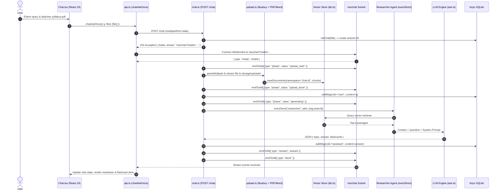
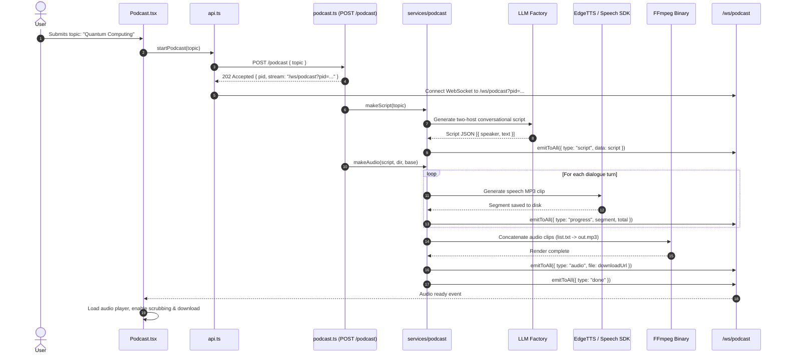
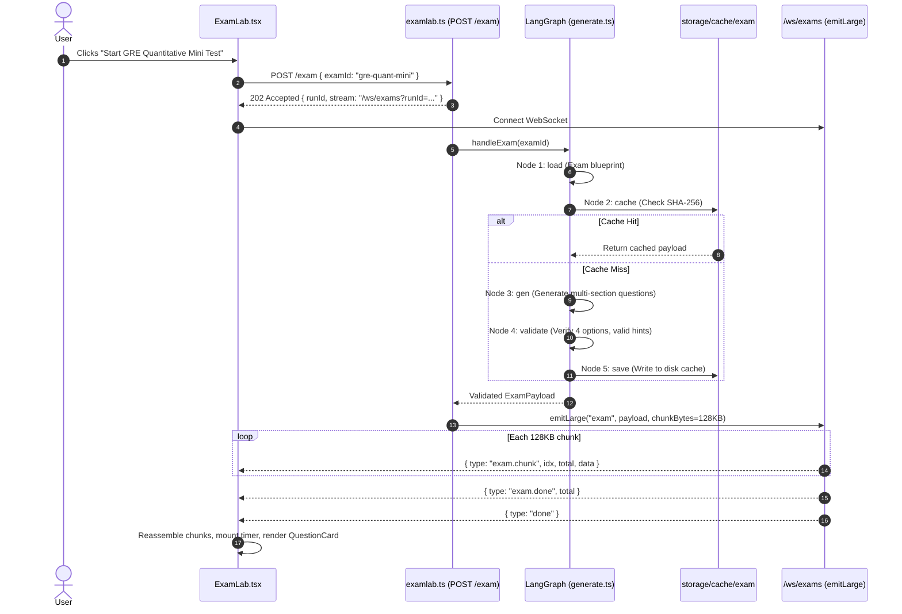
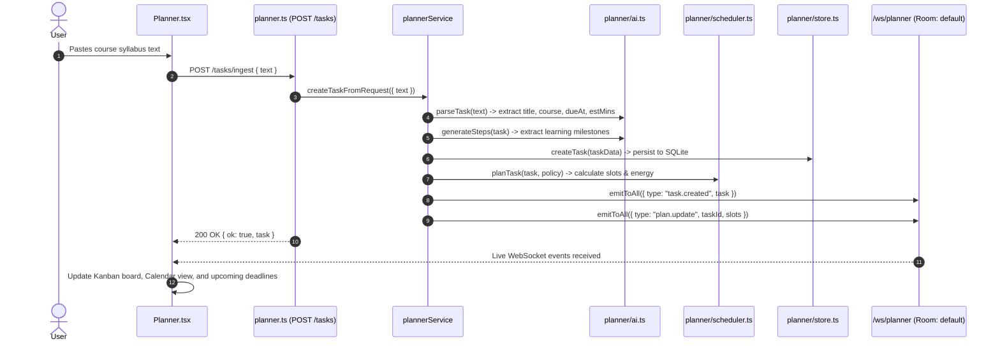
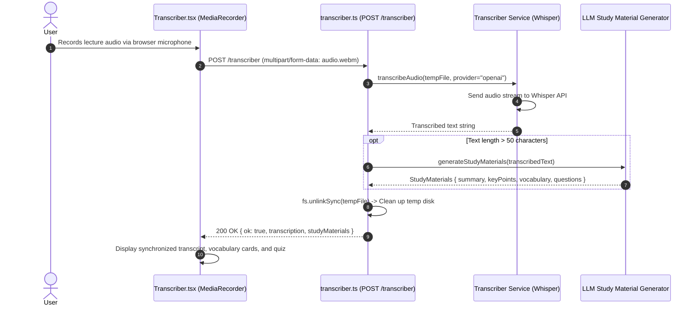

# 13. Frontend-to-Backend Data Flow & Tracing

This document provides visual traces and step-by-step lifecycles for the core data flows in PageLM. It shows how user interactions in the React UI propagate through network calls, server middleware, AI agents, file persistence, and back to the client interface.

---

## 1. Flow 1: Chat Query with Document Upload

---

## 2. Flow 2: Audio Podcast Generation

---

## 3. Flow 3: LangGraph ExamLab Generation & Chunked Delivery

---

## 4. Flow 4: Syllabus Ingestion & Study Plan Generation

---

## 5. Flow 5: Speech-to-Text Transcription & Study Guide Extraction

---

## 6. Summary of Architectural Guarantees

1. **Non-Blocking Main Loop**: Heavy audio encoding, document embedding, and LLM completions are offloaded or executed asynchronously, keeping the HTTP event loop responsive.
2. **Deterministic Re-assembly**: Frontend streaming listeners reassemble chunked payloads safely using unique sequence indices (`idx` and `total`).
3. **Automatic Resource Cleanup**: Temporary audio files and unlinked uploads are systematically deleted after processing to avoid disk bloat.
