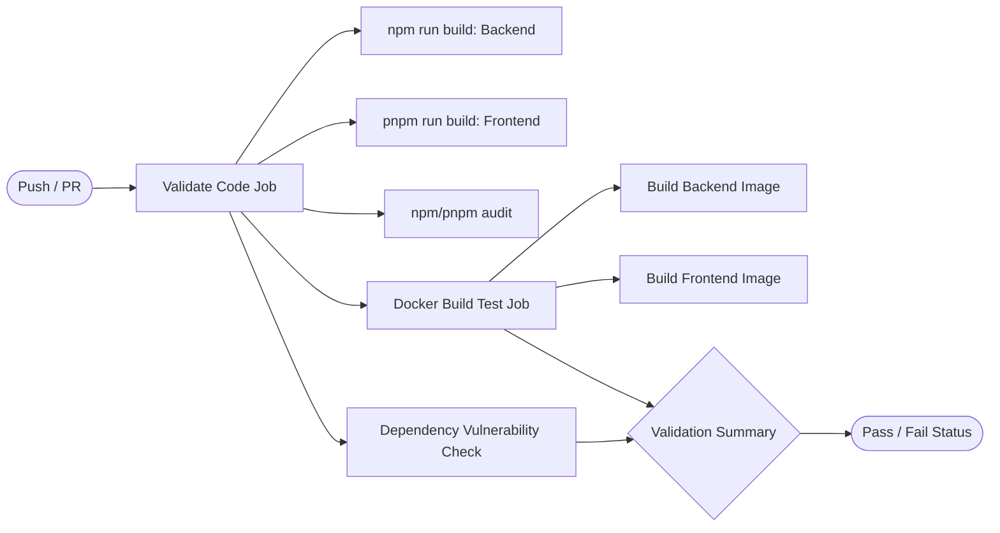

# 15. Testing, Linting & Code Quality

This document outlines the testing architecture, quality assurance tools, continuous integration (CI) workflows, and current testing gaps across the PageLM codebase.

---

## 1. Quality Assurance Stack Overview

PageLM employs several automated validation layers to protect against regressions:

| Area | Tool | Scope | Configuration |
| :--- | :--- | :--- | :--- |
| **Backend Unit Testing** | `vitest` | Model factories, adapters, utilities | Configured in root `package.json` |
| **Backend Typechecking** | `tsc` (TypeScript) | Full backend source tree | `backend/tsconfig.json` |
| **Frontend Typechecking** | `tsc` (TypeScript) | React components & hooks | `frontend/tsconfig.app.json` |
| **Frontend Linting** | `eslint` | React hooks rules, TS rules | `frontend/eslint.config.js` |
| **Frontend Bundler Check**| `vite build` | Asset compilation & chunk trees | `frontend/vite.config.ts` |
| **Continuous Integration**| GitHub Actions | Automated builds & Docker checks | `.github/workflows/ci.yml` |

---

## 2. Testing with Vitest

PageLM uses [Vitest](https://vitest.dev/) for unit testing due to its native TypeScript support and rapid execution.

### Running Tests
From the repository root:
```bash
# Run all test suites
npm test

# Run tests in watch mode
npx vitest watch

# Run tests with UI
npx vitest --ui
```

### Current Test Coverage
Currently, test suites are focused primarily on model provider factories:
- `backend/src/utils/llm/models/__tests__/minimax-factory.test.ts`: Verifies dynamic provider selection and fallback to `embeddings_provider` when the primary provider's embedding constructor fails.
- `backend/src/utils/llm/models/__tests__/minimax-integration.test.ts`: Tests LLM and Embeddings interface contracts.
- `backend/src/utils/llm/models/__tests__/minimax.test.ts`: Mocks API calls to verify headers and endpoint compatibility.

### Sample Test Pattern (Mocking LangChain Providers)
```typescript
import { describe, it, expect, vi, beforeEach } from 'vitest'
import { makeModels } from '../index'
import { config } from '../../../../config/env'

vi.mock('../gemini', () => ({ makeLLM: vi.fn(), makeEmbeddings: vi.fn() }))

describe('Model Factory', () => {
  beforeEach(() => vi.clearAllMocks())

  it('selects Gemini as default provider', () => {
    ;(config as any).provider = 'gemini'
    const { llm } = makeModels()
    expect(llm).toBeDefined()
  })
})
```

---

## 3. Linting and Static Analysis

### Frontend ESLint
From the `frontend/` directory:
```bash
npm run lint
```
Configured via `frontend/eslint.config.js`, enforcing:
- React Hooks rules (`react-hooks/rules-of-hooks`, `react-hooks/exhaustive-deps`).
- React Refresh rules (`react-refresh/only-export-components`).
- TypeScript strict types (`@typescript-eslint/eslint-plugin`).

### TypeScript Compilation & Strict Mode
- Both frontend and backend enable TypeScript `strict` mode.
- Run typecheck without emitting artifacts:
  ```bash
  # Backend
  npx tsc -p backend/tsconfig.json --noEmit

  # Frontend
  cd frontend && npx tsc --noEmit
  ```

---

## 4. Continuous Integration Pipeline (`.github/workflows/ci.yml`)

The CI workflow triggers on pushes and pull requests to `main` and `develop`:



---

## 5. Major Testing Gaps & Contribution Opportunities

Because PageLM is an evolving open-source project, several key testing areas are ripe for contribution:

1. **Missing CI Test Step**:
   The CI workflow (`ci.yml`) runs builds and dependency audits, but **does not run `npm test`**. Adding a test step ensures pull requests do not break existing unit tests.
2. **Backend Route & API Tests**:
   Create integration tests using `supertest` or native Node `fetch` to test routes like `POST /flashcards`, `GET /exams`, and `POST /tasks`.
3. **Agent Runtime Unit Tests**:
   Add test coverage for `backend/src/agents/runtime.ts` to test step execution, timeouts, and retry logic.
4. **Frontend Component Tests**:
   Introduce Vitest + React Testing Library in `frontend/` to test UI components like `QuestionCard`, `PromptBox`, and `MarkdownView`.
5. **RAG Pipeline Ingestion Tests**:
   Add unit tests with sample PDFs and DOCX files to ensure `upload.ts` extraction remains resilient across diverse document formats.
